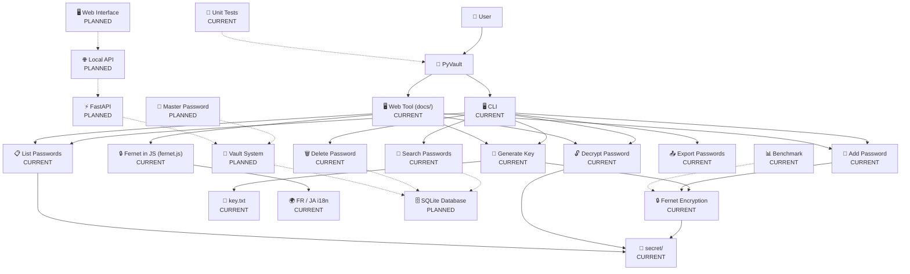
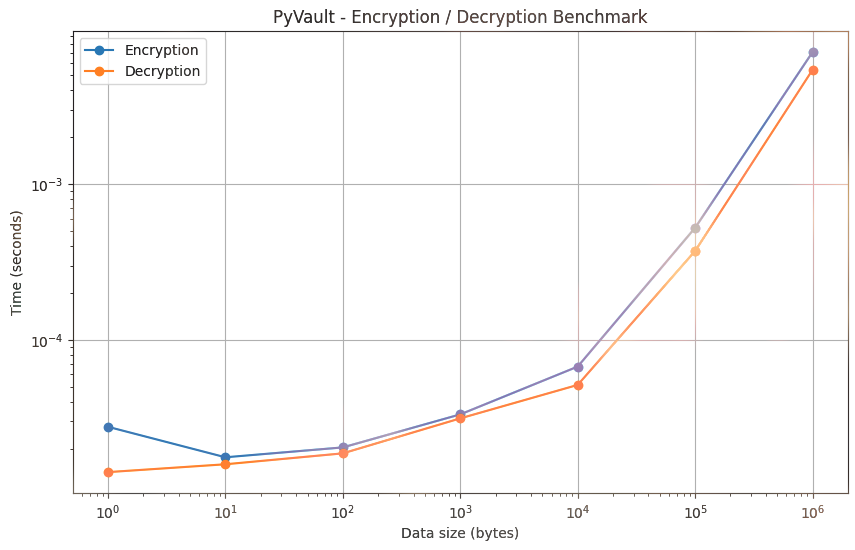

# 🔐 PyVault

**PyVault** is a local password and secrets manager written in Python.

The goal of this project is to build a simple, private and secure way to store sensitive information locally while learning how encryption, databases, web development and application architecture work.

> ⚠️ **PyVault is currently under development.**

---

## ✨ Features

### CLI — `python main.py`

* 🔑 Generate Fernet encryption keys
* 🔐 Encrypt and store passwords using Fernet
* 💾 Store each password in a dedicated file per website in `secret/`
* 🔓 Decrypt and retrieve stored passwords
* 📋 List all saved entries
* 🔎 Search stored passwords
* 🗑️ Delete passwords
* 📤 Export passwords as a zip archive
* 🖥️ Simple CLI interface with ASCII banner
* 🧪 Unit tests (`tests/`)
* 📊 Encryption / decryption benchmark (Jupyter notebook)

### Web — `docs/`

A static site deployed on **GitHub Pages** that mirrors PyVault's features in the browser:

* 🖥️ An **interactive terminal** reproducing the CLI (`python main.py`) directly in the browser
* 🔐 The **real Fernet algorithm re-implemented in JavaScript** (`fernet.js`) using the Web Crypto API — data produced in the browser can be decrypted by the Python CLI and vice-versa
* 💾 Vault entries stored in the browser's `localStorage` (like the `secret/` folder)
* 📤 Zip export built directly in the browser
* 🌍 Bilingual **Français / 日本語** interface with an i18n system
* 📄 README, ideas, tests and "about" pages rendered as a single-page site

### Platform support

* 🖥️ macOS support is available for the terminal clear screen helper used by the CLI
* 🪟 Windows and Linux are supported by the same helper logic

---

## 🧠 Why PyVault?

I wanted to create a project that was more than a simple Python script.

PyVault is also a way for me to learn how different parts of a real application work together:

* Python
* Cryptography
* Databases
* Web development (HTML / CSS / JavaScript)
* APIs
* Authentication
* Security
* Software architecture
* Performance testing

Instead of only following tutorials, I want to build the project myself, encounter problems, research solutions and document the entire process.

---

## 🏗️ Architecture

The architecture below shows both the **current project** and the features planned for the future.



**CURRENT** = already implemented

**PLANNED** = planned for a future version

---

## 📁 Current Project Structure

```text
PyVault/

│
├── commands/             ← CLI commands
│   ├── add.py
│   ├── decrypt.py
│   ├── delete.py
│   ├── export.py
│   ├── generate_key.py
│   ├── list.py
│   └── search.py
│
├── docs/                 ← static website (GitHub Pages)
│   ├── index.html        ← single-page site (FR / JA)
│   ├── robots.txt
│   ├── sitemap.xml
│   └── static/
│       ├── css/styles.css
│       └── js/
│           ├── fernet.js ← Fernet re-implemented in JS (Web Crypto)
│           ├── tool.js   ← interactive browser terminal
│           ├── main.js   ← page routing & mermaid
│           └── i18n.js   ← FR / JA translations
│
├── secret/               ← stores encrypted password files
│
├── tests/                ← unit tests
│
├── images/
│   └── benchmark.png     ← encryption/decryption benchmark
│
├── notebooks/
│   └── benchmark.ipynb   ← Jupyter benchmark
│
├── .github/workflows/    ← GitHub Pages deploy (`static.yml`)
│
├── idea/
│   └── idea.md           ← ideas file
│
├── japanese/             ← (planned) Japanese version of the code
│
├── main.py
├── system_info.py
├── key.txt
├── SECURITY.md
├── .gitignore
├── LICENSE
└── README.md
```

---

## 🔐 Current Encryption System

PyVault currently uses **Fernet** from the `cryptography` library.

A key is generated with:

```python
key = Fernet.generate_key()
```

The key is currently stored locally in:

```text
key.txt
```

When adding a password, PyVault encrypts it before storing it:

```python
fernet = Fernet(key.encode())

encrypted = fernet.encrypt(passwd.encode())
```

The encrypted password is then stored in a dedicated file inside the `secret/` folder, one file per website:

```text
secret/

└── github.txt
```

Example content of `secret/github.txt`:

```text
gAAAAAB...
```

The password itself is **not stored directly** in the file.

The browser-side terminal re-implements the same Fernet scheme in JavaScript (`docs/static/js/fernet.js`) using the **Web Crypto API** (AES-CBC + HMAC-SHA256). Because it follows the Fernet token format, tokens created in the browser are compatible with the Python CLI and the other way around.

> ⚠️ This is an early prototype. The current key management system is not considered secure enough for production use.

---

## 📊 Benchmark

PyVault includes a benchmark using **Jupyter Notebook** to measure the performance of Fernet encryption and decryption.

The benchmark tests multiple data sizes, from a few bytes up to 1 MB, and performs multiple iterations for each size.

The results are visualized in the following graph:



The benchmark helps measure how encryption and decryption performance changes as the amount of data increases.

The benchmark notebook is located at:

```text
notebooks/benchmark.ipynb
```

It can be used to experiment with PyVault's encryption system and compare future implementations.

---

## 🚀 Installation

Clone the repository:

```bash
git clone https://github.com/KirobotDev/PyVault.git

cd PyVault
```

Create a virtual environment:

### Windows

```bash
python -m venv .venv

.venv\Scripts\activate
```

### Linux / macOS

```bash
python3 -m venv .venv

source .venv/bin/activate
```

Install dependencies:

```bash
pip install -r requirements.txt
```

---

## ▶️ Usage

### CLI

Start PyVault:

```bash
python main.py
```

You will see:

```text
S. [Stars Project]      0. [Generate Key (Obliged)] Q. [Leave]

        1. [Add Password]   4. [Export (Zipfiles)]
        2. [List Pswd]      5. [Delete Passwd]
        3. [Decrypt Pswd]   6. [Search Website]

        Choices :
```

#### Generate a key

Choose:

```text
0
```

PyVault will generate a Fernet key and save it to:

```text
key.txt
```

#### Add a password

Choose:

```text
1
```

PyVault will ask for:

```text
Enter your key please thanks... :

Enter name your website Example (github) :

Enter your password :
```

The password will be encrypted and stored in:

```text
secret/<website>.txt
```

#### List saved entries

Choose:

```text
2
```

PyVault will display all files stored in the `secret/` folder, one per website.

#### Decrypt a password

Choose:

```text
3
```

PyVault will ask for:

```text
Enter your key :
Enter the file name example (github.txt) :
```

It will then display:

```text
Your Password is [ your_password_here ]
```

### Web tool (browser)

The interactive terminal is available on the site's **Test** page (or by opening `docs/index.html` locally). It behaves exactly like the CLI but runs entirely in your browser:

```text
0  Generate a key
1  Add a password
2  List entries
3  Decrypt a password
4  Export (zip)
5  Delete an entry
6  Search a site
s  Open the GitHub repo
q  Quit
help / clear
```

Entries are saved in the browser's `localStorage`. Toggle the interface between **Français** and **日本語** with the language button in the top bar.

---

## 🧪 Running Tests

Unit tests are available in the `tests/` folder.

Run them with:

```bash
python -m unittest discover tests
```

---

## 📊 Running the Benchmark

The benchmark is available as a Jupyter Notebook.

Install Jupyter if necessary:

```bash
pip install jupyter
```

Start Jupyter:

```bash
jupyter notebook
```

Then open:

```text
notebooks/benchmark.ipynb
```

The benchmark measures:

* Encryption speed
* Decryption speed
* Different data sizes
* Average execution time
* Performance scaling

---

## 🛠️ Roadmap

### Phase 1 — Prototype

* [x] Generate Fernet key
* [x] Save key locally
* [x] Encrypt passwords
* [x] Save encrypted passwords (one file per website in `secret/`)
* [x] Store website information
* [x] Basic CLI
* [x] Decrypt passwords
* [x] List saved entries

### Phase 2 — Vault

* [x] Search passwords
* [x] Delete passwords
* [x] Export passwords
* [x] Web tool in the browser (`docs/`)
* [x] Fernet re-implemented in JavaScript (Web Crypto)
* [x] Bilingual FR / JA website (i18n)
* [x] Load existing key automatically

### Phase 3 — Security

* [ ] Master password
* [ ] Better key management (KDF)
* [ ] Vault locking
* [ ] Failed attempt protection
* [x] Security tests
* [x] Security policy (`SECURITY.md`)
* [ ] Threat model

### Phase 4 — Database

* [ ] SQLite
* [ ] Database models
* [ ] Encrypted database fields
* [ ] Data validation
* [ ] Database migrations

### Phase 5 — API

* [ ] Local API
* [ ] FastAPI
* [ ] Authentication
* [ ] API documentation

### Phase 6 — Interface

* [ ] Full web interface
* [ ] Vault dashboard
* [ ] Password manager UI
* [ ] API integration

### Phase 7 — Open Source

* [ ] Complete documentation
* [x] Automated tests
* [x] GitHub Pages deployment (CI/CD)
* [ ] Security review
* [ ] PyPI package

---

## 🔒 Security

PyVault is an **experimental learning project** and is **not intended for production use**.

The current key management (a plain `key.txt` sitting on disk, no master password) is not secure enough for storing real secrets.

See [`SECURITY.md`](SECURITY.md) for the supported versions and how to responsibly report a vulnerability.

---

## 🌍 Website

PyVault has a static website in the `docs/` folder, automatically deployed to **GitHub Pages** on every push to `main` (see `.github/workflows/static.yml`).

It includes:

* An **interactive browser terminal** reproducing the CLI
* The **README**, ideas, tests and about pages
* A **Français / 日本語** language switch

---

## 📚 Development Story

PyVault isn't only a software project.

I also want to document the process of building it.

The documentation will cover:

```text
Idea

  ↓

First prototype

  ↓

Encryption

  ↓

Problems

  ↓

Research

  ↓

Solutions

  ↓

Security

  ↓

Testing

  ↓

Benchmarking

  ↓

Final application
```

The objective is to show what I learned, what went wrong and how the project evolved over time.

---

## 🧪 Status

**Current version:** `0.2.0-dev`

PyVault is currently an experimental project.

The project is actively being developed and its architecture may change significantly.

---

## 🤝 Contributing

Contributions, suggestions and bug reports are welcome.

If you find a problem, feel free to open an issue.

For larger changes, please open an issue first to discuss the idea.

---

## 📄 License

PyVault is released under the **MIT License**.

See [`LICENSE`](LICENSE) for more information.

---

## 👤 Author

**xql**

GitHub: https://github.com/KirobotDev

---

> Built with Python 🐍 & JavaScript ⚡
>
> Learning by building.
