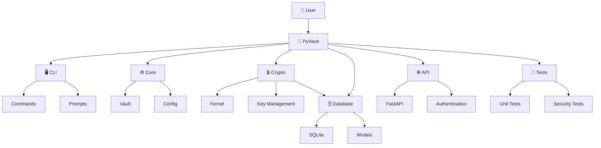

# 🔐 PyVault

**PyVault** is a local password and secrets manager written in Python.

The goal of this project is to build a simple, private and secure way to store sensitive information locally while learning how encryption, databases and application architecture work.

> ⚠️ **PyVault is currently under development. Do not use it to store real passwords or sensitive information yet.**

---

## ✨ Features

* 🔑 Generate encryption keys
* 🔐 Encrypt and decrypt sensitive data
* 💾 Local storage
* 🗄️ SQLite database support *(planned)*
* 🛡️ Master password *(planned)*
* 🔎 Search stored secrets *(planned)*
* 🔒 Automatic vault locking *(planned)*
* 🌐 Local API *(planned)*
* 🖥️ Web interface *(planned)*

---

## 🧠 Why PyVault?

I wanted to create a project that was more than a simple Python script.

PyVault is also a way for me to learn how different parts of a real application work together:

* Python
* Cryptography
* Databases
* APIs
* Authentication
* Security
* Software architecture

Instead of only following tutorials, I want to build the project myself, encounter problems, research solutions and document the entire process.

---

## 🏗️ Project Structure

The project is still evolving, but the goal is to have a structure similar to:

```text
PyVault/
│
├── pyvault/
│   ├── crypto/
│   ├── database/
│   ├── core/
│   └── cli/
│
├── tests/
│
├── docs/
│
├── .gitignore
├── LICENSE
├── README.md
└── requirements.txt
```

---

## 🏗️ Architecture




---

## 🔐 Cryptography

PyVault uses the [`cryptography`](https://cryptography.io/) Python library.

For the current prototype, encryption keys are generated using Fernet:

```python
from cryptography.fernet import Fernet

key = Fernet.generate_key()
```

The project does **not** attempt to implement its own cryptographic algorithm.

Using established cryptographic primitives is important because implementing cryptography incorrectly can make an application insecure.

---

## 🚀 Installation

Clone the repository:

```bash
git clone https://github.com/KirobotDev/PyVault.git
cd PyVault
```

Create a virtual environment:

### Windows

```bash
python -m venv .venv
.venv\Scripts\activate
```

### Linux / macOS

```bash
python3 -m venv .venv
source .venv/bin/activate
```

Install the dependencies:

```bash
pip install -r requirements.txt
```

---

## ▶️ Usage

The current prototype can generate an encryption key:

```bash
python main.py
```

A `key.txt` file will be created locally.

Example:

```text
Your key is already in key.txt
```

### ⚠️ Never share your encryption key

Your `key.txt` file should **never** be uploaded to GitHub or shared with anyone.

Make sure it is included in `.gitignore`:

```gitignore
key.txt
.venv/
__pycache__/
*.pyc
```

---

## 🛠️ Roadmap

PyVault is being developed progressively.

### Phase 1 — Prototype

* [x] Generate Fernet key
* [x] Save key locally
* [ ] Load existing key
* [ ] Encrypt data
* [ ] Decrypt data

### Phase 2 — Vault

* [ ] Create vault
* [ ] Master password
* [ ] Store credentials
* [ ] Delete credentials
* [ ] Search credentials
* [ ] List credentials

### Phase 3 — Database

* [ ] SQLite integration
* [ ] Encrypted database fields
* [ ] Database migrations
* [ ] Data validation

### Phase 4 — Security

* [ ] Failed login protection
* [ ] Vault locking
* [ ] Secure key management
* [ ] Security tests
* [ ] Threat model

### Phase 5 — API

* [ ] Local FastAPI server
* [ ] Authentication
* [ ] API documentation
* [ ] Web interface

### Phase 6 — Open Source

* [ ] Complete documentation
* [ ] Automated tests
* [ ] CI/CD
* [ ] Security audit
* [ ] PyPI package

---

## 📚 Development Story

PyVault isn't only a software project.

I also want to document the process of building it.

The documentation will cover:

```text
Idea
  ↓
First prototype
  ↓
Problems
  ↓
Research
  ↓
Solutions
  ↓
Security
  ↓
Testing
  ↓
Final application
```

The objective is to show what I learned, what went wrong and how the project evolved over time.

---

## 🧪 Status

**Current version:** `0.1.0-dev`

PyVault is currently an experimental project.

Things can change significantly during development.

---

## 🤝 Contributing

Contributions, suggestions and bug reports are welcome.

If you find a problem, feel free to open an issue.

For larger changes, please open an issue first to discuss the idea.

---

## 📄 License

PyVault is released under the **MIT License**.

See [`LICENSE`](LICENSE) for more information.

---

## 👤 Author

**xql**

GitHub: https://github.com/KirobotDev

---

> Built with Python 🐍
>
> Learning by building.
