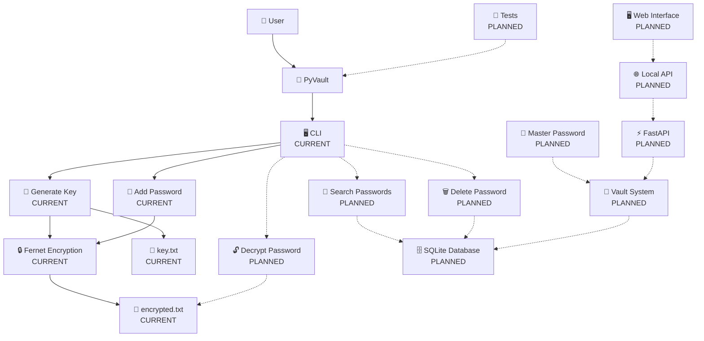

# 🔐 PyVault

**PyVault** is a local password and secrets manager written in Python.

The goal of this project is to build a simple, private and secure way to store sensitive information locally while learning how encryption, databases and application architecture work.

> ⚠️ **PyVault is currently under development. Do not use it to store real passwords or sensitive information yet.**

---

## ✨ Features

### Currently available

* 🔑 Generate Fernet encryption keys
* 🔐 Encrypt passwords using Fernet
* 💾 Store encrypted passwords locally
* 🌐 Store the website associated with a password
* 🖥️ Simple CLI interface

### Planned

* 🔓 Decrypt and retrieve passwords
* 🗄️ SQLite database
* 🔑 Master password
* 🔒 Vault locking
* 🔎 Search stored passwords
* 🗑️ Delete passwords
* 🌐 Local API
* 🖥️ Web interface
* 🧪 Complete test suite

---

## 🧠 Why PyVault?

I wanted to create a project that was more than a simple Python script.

PyVault is also a way for me to learn how different parts of a real application work together:

* Python
* Cryptography
* Databases
* APIs
* Authentication
* Security
* Software architecture

Instead of only following tutorials, I want to build the project myself, encounter problems, research solutions and document the entire process.

---

## 🏗️ Architecture

The architecture below shows both the **current project** and the features planned for the future.



**CURRENT** = already implemented

**PLANNED** = planned for a future version

---

## 📁 Current Project Structure

```text
PyVault/
│
├── commands/
│   ├── add.py
│   └── generate_key.py
│
├── system_info/
│   └── ...
│
├── main.py
├── key.txt
├── encrypted.txt
├── requirements.txt
├── .gitignore
├── LICENSE
└── README.md
```

---

## 🔐 Current Encryption System

PyVault currently uses **Fernet** from the `cryptography` library.

A key is generated with:

```python
key = Fernet.generate_key()
```

The key is currently stored locally in:

```text
key.txt
```

When adding a password, PyVault encrypts it before storing it:

```python
fernet = Fernet(key.encode())

encrypted = fernet.encrypt(passwd.encode())
```

The encrypted password is then stored in:

```text
encrypted.txt
```

Example:

```text
github.com
gAAAAAB...
```

The password itself is **not stored directly** in the file.

> ⚠️ This is an early prototype. The current key management system is not considered secure enough for production use.

---

## 🚀 Installation

Clone the repository:

```bash
git clone https://github.com/KirobotDev/PyVault.git
cd PyVault
```

Create a virtual environment:

### Windows

```bash
python -m venv .venv
.venv\Scripts\activate
```

### Linux / macOS

```bash
python3 -m venv .venv
source .venv/bin/activate
```

Install dependencies:

```bash
pip install -r requirements.txt
```

---

## ▶️ Usage

Start PyVault:

```bash
python main.py
```

You will currently see:

```text
0. [Generate Key (Obliged)]
1. [Add Password]

Choices :
```

### Generate a key

Choose:

```text
0
```

PyVault will generate a Fernet key and save it to:

```text
key.txt
```

### Add a password

Choose:

```text
1
```

PyVault will ask for:

```text
Enter your key please thanks... :
Enter link your website Example (github.com) :
Enter your password :
```

The password will then be encrypted and stored in:

```text
encrypted.txt
```

---

## 🛠️ Roadmap

### Phase 1 — Prototype

* [x] Generate Fernet key
* [x] Save key locally
* [x] Encrypt passwords
* [x] Save encrypted passwords
* [x] Store website information
* [x] Basic CLI

### Phase 2 — Vault

* [ ] Load existing key automatically
* [ ] Decrypt passwords
* [ ] Retrieve saved passwords
* [ ] Search passwords
* [ ] Delete passwords
* [ ] Better data structure

### Phase 3 — Security

* [ ] Master password
* [ ] Better key management
* [ ] Vault locking
* [ ] Failed attempt protection
* [ ] Security tests
* [ ] Threat model

### Phase 4 — Database

* [ ] SQLite
* [ ] Database models
* [ ] Encrypted database fields
* [ ] Data validation
* [ ] Database migrations

### Phase 5 — API

* [ ] Local API
* [ ] FastAPI
* [ ] Authentication
* [ ] API documentation

### Phase 6 — Interface

* [ ] Web interface
* [ ] Vault dashboard
* [ ] Password manager UI
* [ ] API integration

### Phase 7 — Open Source

* [ ] Complete documentation
* [ ] Automated tests
* [ ] CI/CD
* [ ] Security review
* [ ] PyPI package

---

## 📚 Development Story

PyVault isn't only a software project.

I also want to document the process of building it.

The documentation will cover:

```text
Idea
  ↓
First prototype
  ↓
Encryption
  ↓
Problems
  ↓
Research
  ↓
Solutions
  ↓
Security
  ↓
Testing
  ↓
Final application
```

The objective is to show what I learned, what went wrong and how the project evolved over time.

---

## 🧪 Status

**Current version:** `0.1.0-dev`

PyVault is currently an experimental project.

The project is actively being developed and its architecture may change significantly.

---

## 🤝 Contributing

Contributions, suggestions and bug reports are welcome.

If you find a problem, feel free to open an issue.

For larger changes, please open an issue first to discuss the idea.

---

## 📄 License

PyVault is released under the **MIT License**.

See [`LICENSE`](LICENSE) for more information.

---

## 👤 Author

**xql**

GitHub: https://github.com/KirobotDev

---

> Built with Python 🐍
>
> Learning by building.
