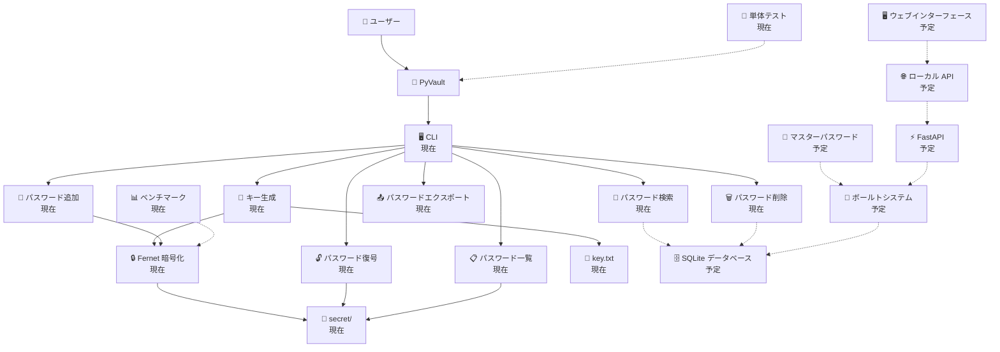

# 🔐 PyVault（日本語版）

**PyVault** は、Python で書かれたローカルパスワード＆シークレット管理ツールです。

このプロジェクトの目標は、暗号化・データベース・アプリケーションのアーキテクチャについて学びながら、機密情報をローカルにシンプルかつプライベートに保存する安全な方法を構築することです。

> ⚠️ **PyVault は現在開発中です。**

---

## ✨ 機能

### 現在利用可能

* 🔑 Fernet 暗号化キーの生成
* 🔐 Fernet を使ったパスワードの暗号化と保存
* 💾 ウェブサイトごとに専用ファイルへパスワードを保存
* 🔓 保存済みパスワードの復号化と取得
* 📋 保存済みエントリの一覧表示
* 🔎 保存済みパスワードの検索
* 🗑️ パスワードの削除
* 📤 パスワードのエクスポート
* 🖥️ シンプルな CLI インターフェース
* 🧪 単体テスト
* 📊 暗号化／復号化ベンチマーク

### 予定

* 🗄️ SQLite データベース
* 🔑 マスターパスワード
* 🔒 ボールトのロック
* 🌐 ローカル API
* 🖥️ ウェブインターフェース

---

## 🧠 PyVault を作る理由

私は、単なる Python スクリプト以上のプロジェクトを作りたいと思いました。

PyVault は、実際のアプリケーションのさまざまな部分がどのように連携するかを学ぶための手段でもあります。

* Python
* 暗号化（Cryptography）
* データベース
* API
* 認証
* セキュリティ
* ソフトウェアアーキテクチャ
* パフォーマンステスト

チュートリアルに従うだけではなく、プロジェクトを自分で構築し、問題に直面して、調査し、そのプロセス全体を文書化したいと考えています。

---

## 🏗️ アーキテクチャ

下記のアーキテクチャは、**現在のプロジェクト**と将来の予定機能の両方を示しています。



**現在** = すでに実装済み

**予定** = 将来のバージョンで計画中

---

## 📁 現在のプロジェクト構成

```text
PyVault/

│
├── commands/
│   ├── add.py
│   ├── decrypt.py
│   ├── delete.py
│   ├── export.py
│   ├── generate_key.py
│   ├── list.py
│   └── search.py
│
├── secret/               ← 暗号化されたパスワードファイルの保存先
│
├── tests/                ← 単体テスト
│
├── images/
│   └── benchmark.png     ← 暗号化／復号化ベンチマーク
│
├── notebooks/
│   └── benchmark.ipynb   ← Jupyter ベンチマーク
│
├── main.py
├── system_info.py
├── key.txt
├── .gitignore
├── LICENSE
└── README.md
```

---

## 🔐 現在の暗号化システム

PyVault は現在、`cryptography` ライブラリの **Fernet** を使用しています。

キーは次のように生成されます。

```python
鍵 = Fernet.generate_key()
```

キーは現在、ローカルの次のファイルに保存されます。

```text
key.txt
```

パスワードを追加するとき、PyVault は保存前にパスワードを暗号化します。

```python
暗号器 = Fernet(鍵.encode())

暗号文 = 暗号器.encrypt(パスワード.encode())
```

暗号化されたパスワードは、`secret/` フォルダ内のウェブサイトごとの専用ファイルに保存されます。

```text
secret/

└── github.txt
```

`secret/github.txt` の内容例：

```text
gAAAAAB...
```

パスワード自体はファイルに**直接保存されません**。

> ⚠️ これは初期プロトタイプです。現在のキー管理システムは、本番利用には十分に安全とは見なされていません。

---

## 📊 ベンチマーク

PyVault には、Fernet の暗号化と復号化のパフォーマンスを測定する **Jupyter Notebook** ベンチマークが含まれています。

ベンチマークは、数バイトから最大 1 MB までの複数のデータサイズをテストし、各サイズについて複数回の反復を実行します。

結果は次のグラフで可視化されます。


ベンチマークは、データ量の増加に伴って暗号化・復号化のパフォーマンスがどのように変化するかを測定するのに役立ちます。

ベンチマークノートブックは次の場所にあります。

```text
notebooks/benchmark.ipynb
```

PyVault の暗号化システムの実験や、将来の実装との比較に使用できます。

---

## 🚀 インストール

リポジトリをクローンします。

```bash
git clone https://github.com/KirobotDev/PyVault.git

cd PyVault
```

仮想環境を作成します。

### Windows

```bash
python -m venv .venv

.venv\Scripts\activate
```

### Linux / macOS

```bash
python3 -m venv .venv

source .venv/bin/activate
```

依存関係をインストールします。

```bash
pip install -r requirements.txt
```

---

## ▶️ 使い方

PyVault を起動します。

```bash
python main.py
```

次の画面が表示されます。

```text
S. [プロジェクトにスターを付ける] 0. [鍵の生成（必須）] Q. [終了]

        1. [パスワード追加]    4. [エクスポート（Zip）]
        2. [一覧表示]          5. [パスワード削除]
        3. [パスワード復号]    6. [ウェブサイト検索]

        選択 :
```

### 鍵を生成する

次のように入力して選択します。

```text
0
```

PyVault が Fernet キーを生成し、次の場所に保存します。

```text
key.txt
```

### パスワードを追加する

次のように入力して選択します。

```text
1
```

PyVault は次の入力を求めます。

```text
鍵を入力してください、お願いします… :

ウェブサイトの名前を入力してください（例：github） :

パスワードを入力してください :
```

パスワードは暗号化されて、次の場所に保存されます。

```text
secret/<ウェブサイト名>.txt
```

### 保存済みエントリを一覧表示する

次のように入力して選択します。

```text
2
```

PyVault は `secret/` フォルダに保存されているウェブサイトごとの全ファイルを表示します。

### パスワードを復号する

次のように入力して選択します。

```text
3
```

PyVault は次の入力を求めます。

```text
鍵を入力してください :
ファイル名を入力してください（例：github.txt） :
```

すると次のように表示されます。

```text
あなたのパスワードは [ あなたのパスワード ] です
```

---

## 🧪 テストの実行

単体テストは `tests/` フォルダにあります。

次のコマンドで実行できます。

```bash
python -m unittest discover tests
```

---

## 📊 ベンチマークの実行

ベンチマークは Jupyter Notebook として利用できます。

必要に応じて Jupyter をインストールします。

```bash
pip install jupyter
```

Jupyter を起動します。

```bash
jupyter notebook
```

そして次のファイルを開きます。

```text
notebooks/benchmark.ipynb
```

ベンチマークでは以下を測定します。

* 暗号化速度
* 復号化速度
* さまざまなデータサイズ
* 平均実行時間
* パフォーマンスのスケーリング

---

## 🛠️ ロードマップ

### フェーズ 1 — プロトタイプ

* [x] Fernet キーの生成
* [x] キーをローカルに保存
* [x] パスワードの暗号化
* [x] 暗号化されたパスワードの保存（`secret/` 内のウェブサイトごとのファイル）
* [x] ウェブサイト情報の保存
* [x] 基本 CLI
* [x] パスワードの復号化
* [x] 保存済みエントリの一覧表示

### フェーズ 2 — ボールト

* [x] パスワードの検索
* [x] パスワードの削除
* [x] パスワードのエクスポート
* [ ] 既存キーの自動読み込み
* [ ] より良いデータ構造

### フェーズ 3 — セキュリティ

* [ ] マスターパスワード
* [ ] より良いキー管理
* [ ] ボールトのロック
* [ ] 失敗試行への保護
* [x] セキュリティテスト
* [ ] 脅威モデル

### フェーズ 4 — データベース

* [ ] SQLite
* [ ] データベースモデル
* [ ] 暗号化されたデータベースフィールド
* [ ] データ検証
* [ ] データベースマイグレーション

### フェーズ 5 — API

* [ ] ローカル API
* [ ] FastAPI
* [ ] 認証
* [ ] API ドキュメント

### フェーズ 6 — インターフェース

* [ ] ウェブインターフェース
* [ ] ボールトダッシュボード
* [ ] パスワードマネージャー UI
* [ ] API 統合

### フェーズ 7 — オープンソース

* [ ] 完全なドキュメント
* [x] 自動テスト
* [ ] CI/CD
* [ ] セキュリティレビュー
* [ ] PyPI パッケージ

---

## 📚 開発ストーリー

PyVault は単なるソフトウェアプロジェクトではありません。

構築のプロセスを文書化することも目的としています。

ドキュメントでは以下を取り上げます。

```text
アイデア

  ↓

最初のプロトタイプ

  ↓

暗号化

  ↓

問題

  ↓

調査

  ↓

解決策

  ↓

セキュリティ

  ↓

テスト

  ↓

ベンチマーク

  ↓

最終アプリケーション
```

目標は、何を学んだのか、何がうまくいかなかったのか、そしてプロジェクトがどのように進化してきたのかを示すことです。

---

## 🧪 ステータス

**現在のバージョン:** `0.2.0-dev`

PyVault は現在、実験的なプロジェクトです。

プロジェクトは積極的に開発されており、そのアーキテクチャは大きく変わる可能性があります。

---

## 🤝 コントリビューション

コントリビューション、提案、バグ報告を歓迎します。

問題を見つけたら、お気軽に issue を開いてください。

大きな変更の場合は、先に issue を開いてアイデアについて話し合ってください。

---

## 📄 ライセンス

PyVault は **MIT ライセンス** のもとで公開されています。

詳細は [`LICENSE`](LICENSE) を参照してください。

---

## 👤 作者

**xql**

GitHub: https://github.com/KirobotDev

---

> Python 🐍 で構築されています。
>
> 作って学ぶ。（Learning by building.）